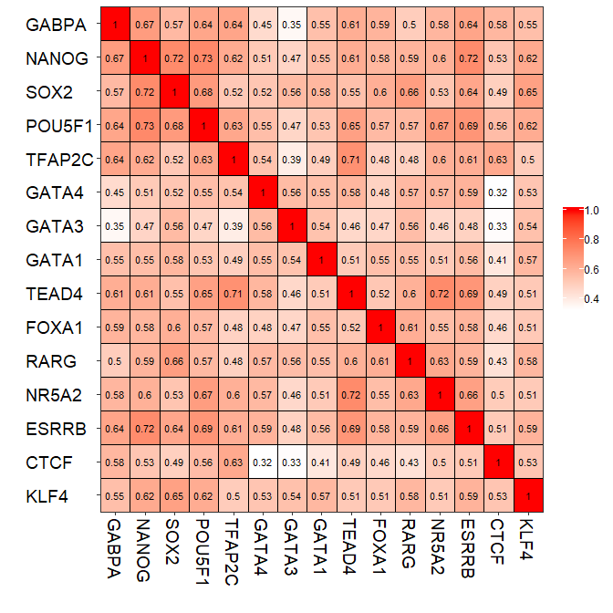
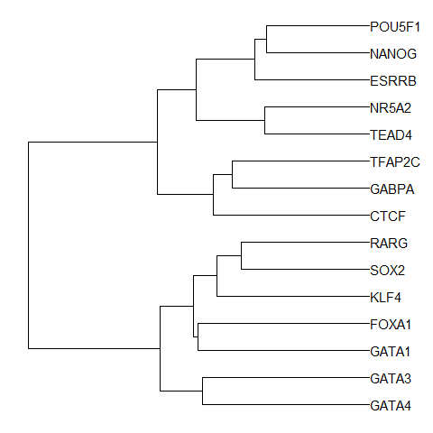

## Semantic Similarity

``` r
genes <- c("GABPA", "NANOG", "SOX2", "POU5F1", "TFAP2C", "GATA4", "GATA3",
           "GATA1", "TEAD4", "FOXA1", "RARG", "NR5A2", "ESRRB", "CTCF", "KLF4")

genes.df <- clusterProfiler::bitr(genes, "SYMBOL", "ENTREZID", "org.Hs.eg.db")
```

    ## 

    ## Loading required package: org.Hs.eg.db

    ## Loading required package: AnnotationDbi

    ## Loading required package: stats4

    ## Loading required package: BiocGenerics

    ## Loading required package: parallel

    ## 
    ## Attaching package: 'BiocGenerics'

    ## The following objects are masked from 'package:parallel':
    ## 
    ##     clusterApply, clusterApplyLB, clusterCall, clusterEvalQ,
    ##     clusterExport, clusterMap, parApply, parCapply, parLapply,
    ##     parLapplyLB, parRapply, parSapply, parSapplyLB

    ## The following objects are masked from 'package:stats':
    ## 
    ##     IQR, mad, sd, var, xtabs

    ## The following objects are masked from 'package:base':
    ## 
    ##     anyDuplicated, append, as.data.frame, basename, cbind,
    ##     colMeans, colnames, colSums, dirname, do.call, duplicated,
    ##     eval, evalq, Filter, Find, get, grep, grepl, intersect,
    ##     is.unsorted, lapply, lengths, Map, mapply, match, mget, order,
    ##     paste, pmax, pmax.int, pmin, pmin.int, Position, rank, rbind,
    ##     Reduce, rowMeans, rownames, rowSums, sapply, setdiff, sort,
    ##     table, tapply, union, unique, unsplit, which, which.max,
    ##     which.min

    ## Loading required package: Biobase

    ## Welcome to Bioconductor
    ## 
    ##     Vignettes contain introductory material; view with
    ##     'browseVignettes()'. To cite Bioconductor, see
    ##     'citation("Biobase")', and for packages 'citation("pkgname")'.

    ## Loading required package: IRanges

    ## Loading required package: S4Vectors

    ## 
    ## Attaching package: 'S4Vectors'

    ## The following object is masked from 'package:base':
    ## 
    ##     expand.grid

    ## 
    ## Attaching package: 'IRanges'

    ## The following object is masked from 'package:grDevices':
    ## 
    ##     windows

    ## 

    ## 'select()' returned 1:1 mapping between keys and columns

``` r
eg <- genes.df[,2]
genes <- genes.df[,1]
names(genes) <- eg

library(GOSemSim)
```

    ## GOSemSim v2.8.0  For help: https://guangchuangyu.github.io/GOSemSim
    ## 
    ## If you use GOSemSim in published research, please cite:
    ## Guangchuang Yu, Fei Li, Yide Qin, Xiaochen Bo, Yibo Wu, Shengqi Wang. GOSemSim: an R package for measuring semantic similarity among GO terms and gene products Bioinformatics 2010, 26(7):976-978

``` r
hsGO <- godata('org.Hs.eg.db', ont="BP")
```

    ## preparing gene to GO mapping data...

    ## preparing IC data...

``` r
sim <- mgeneSim(eg, semData = hsGO, measure = "Wang", combine = "BMA", verbose=FALSE)

rownames(sim) <- genes[rownames(sim)]
colnames(sim) <- genes[colnames(sim)]
DOSE::simplot(sim)
```

    ## Using ID as id variables

<!-- -->

## Hierarchical clustering

``` r
library(ggtree)
```

    ## ggtree v1.15.6  For help: https://guangchuangyu.github.io/software/ggtree
    ## 
    ## If you use ggtree in published research, please cite the most appropriate paper(s):
    ## 
    ## - Guangchuang Yu, David Smith, Huachen Zhu, Yi Guan, Tommy Tsan-Yuk Lam. ggtree: an R package for visualization and annotation of phylogenetic trees with their covariates and other associated data. Methods in Ecology and Evolution 2017, 8(1):28-36, doi:10.1111/2041-210X.12628
    ## 
    ## - Guangchuang Yu, Tommy Tsan-Yuk Lam, Huachen Zhu, Yi Guan. Two methods for mapping and visualizing associated data on phylogeny using ggtree. Molecular Biology and Evolution 2018, accepted. doi: 10.1093/molbev/msy194

    ## 
    ## Attaching package: 'ggtree'

    ## The following object is masked from 'package:IRanges':
    ## 
    ##     collapse

    ## The following object is masked from 'package:S4Vectors':
    ## 
    ##     expand

``` r
phylo <- ape::as.phylo(hclust(as.dist(1-sim), method="ward.D"))
p = ggtree(phylo) +  geom_tiplab()
print(p + xlim(0, 0.5))
```

<!-- -->

## Semantic clustering + expression profile

``` r
library(tidyr)
```

    ## 
    ## Attaching package: 'tidyr'

    ## The following object is masked from 'package:ggtree':
    ## 
    ##     expand

    ## The following object is masked from 'package:S4Vectors':
    ## 
    ##     expand

``` r
library(dplyr)
```

    ## 
    ## Attaching package: 'dplyr'

    ## The following object is masked from 'package:AnnotationDbi':
    ## 
    ##     select

    ## The following objects are masked from 'package:IRanges':
    ## 
    ##     collapse, desc, intersect, setdiff, slice, union

    ## The following objects are masked from 'package:S4Vectors':
    ## 
    ##     first, intersect, rename, setdiff, setequal, union

    ## The following object is masked from 'package:Biobase':
    ## 
    ##     combine

    ## The following objects are masked from 'package:BiocGenerics':
    ## 
    ##     combine, intersect, setdiff, union

    ## The following objects are masked from 'package:stats':
    ## 
    ##     filter, lag

    ## The following objects are masked from 'package:base':
    ## 
    ##     intersect, setdiff, setequal, union

``` r
mergefpkm <- read.table("easy_input.txt",header = T, as.is = 1)
head(mergefpkm)
```

    ##    gene     cell2     cell4    cell8      icm    es200     es1k     es50k
    ## 1  ATF1 2.040e-04   0.41610   0.7587  39.8500    2.781    22.15    9.9210
    ## 2  ATF2 8.545e-03   0.06188   1.2170  61.8300   18.970    20.94   16.5900
    ## 3  ATF4 1.000e-06   0.02202   0.0909   0.5796    9.861    73.39   16.0600
    ## 4 BACH1 3.506e-01  12.93000  26.6500 140.1000   82.550    83.08   49.9200
    ## 5 CLOCK 2.318e-03   0.01329   2.0520  68.3000   25.160    27.30    0.8313
    ## 6  CTCF 3.313e+02 443.00000 441.4000 970.9000 6312.000 10890.00 5981.0000
    ##                                                                      id
    ## 1              Atf1(bZIP)/K562-ATF1-ChIP-Seq(GSE31477)/Homer-GATGACGTCA
    ## 2           Atf2(bZIP)/3T3L1-Atf2-ChIP-Seq(GSE56872)/Homer-NRRTGACGTCAT
    ## 3               Atf4(bZIP)/MEF-Atf4-ChIP-Seq(GSE35681)/Homer-MTGATGCAAT
    ## 4       Bach1(bZIP)/K562-Bach1-ChIP-Seq(GSE31477)/Homer-AWWNTGCTGAGTCAT
    ## 5             CLOCK(bHLH)/Liver-Clock-ChIP-Seq(GSE39860)/Homer-GHCACGTG
    ## 6 CTCF(Zf)/CD4+-CTCF-ChIP-Seq(Barski_et_al.)/Homer-AYAGTGCCMYCTRGTGGCCA
    ##   MII_oocyte   zygote early_2cell   X2cell    X4cell    X8cell       ICM
    ## 1  43.751300 48.35030    55.12980 68.59160  77.91830  65.78570  36.12430
    ## 2  57.351200 55.16790    66.27700 53.94260  32.50640  18.20050  14.35990
    ## 3  49.306000 92.15880   118.76400 91.22960 113.91100 130.36900 128.12000
    ## 4   0.623454  1.43436     1.56799  8.56516  11.16270  16.08480   4.99782
    ## 5  11.859600 12.36550    14.31840  9.11771   2.23754   1.69165   1.03548
    ## 6  13.290000 15.96850    12.37020 38.02200  16.36380  15.91230   7.74287
    ##         mESC
    ## 1  29.247400
    ## 2   8.008880
    ## 3 116.519000
    ## 4   0.889422
    ## 5   0.918541
    ## 6  22.571800

``` r
## filtering with motifs in the nature paper:
## The landscape of accessible chromatin in mammalian preimplantation embryos
papermotif <- c("GABPA","NANOG","SOX2","POU5F1","TFAP2C","GATA4","GATA3","GATA1",
                "TEAD4","FOXA1","RARG","NR5A2","ESRRB","CTCF","KLF4")
pmergefpkm <- subset(mergefpkm, gene %in% papermotif)

pscore <- pmergefpkm[, 1:8] %>% gather(type, pscore, -gene) %>%
  group_by(gene, type) %>% summarise(pscore = max(pscore))
pscore$type[pscore$type == "icm"] = "ICM"

fpkm <- pmergefpkm[,c(1,13:17)] %>% gather(type, FPKM, -gene)
fpkm$type <- sub("^X(\\d)(.*)$", "\\2\\1", fpkm$type)

d <- left_join(pscore, fpkm, by=c("gene", "type")) %>%
  filter(!is.na(FPKM))

d$pscore[d$pscore > 500] = 500
d$pscore[d$pscore < 10] = 10
d$FPKM[d$FPKM > 20] = 20


d$type <- factor(d$type, levels = c("cell2", "cell4", "cell8", "ICM"))

library(ggplot2)

facet_plot(p, panel="Motif", data = d, 
           geom = geom_point, mapping = aes(x=as.numeric(type), size = pscore, color=FPKM)) %>%
  facet_plot(panel="Motif", data=unique(d[d$gene == "GATA4",]),
             geom = geom_text, mapping = aes(x = as.numeric(type), y=0, label=type)) + 
  xlim_expand(c(0, 0.5), "Tree") + xlim_expand(c(0.5, 4.5), "Motif") +
  scale_color_viridis_c() + theme(legend.position = "right") + 
  scale_size_continuous(range=c(0,10), name = "-log(p value)")
```

<!-- -->

## Reference

1.  Wu J, Huang B, Chen H, et al (2016) The landscape of accessible
    chromatin in mammalian preimplantation embryos. Nature
    534:652鈥\<93\>657. <https://doi.org/10.1038/nature18606>
2.  Yu G, Li F, Qin Y, et al (2010) GOSemSim: an R package for measuring
    semantic similarity among GO terms and gene products. Bioinformatics
    26:976鈥\<93\>978. <https://doi.org/10.1093/bioinformatics/btq064>
3.  Yu G, Wang L-G, Han Y, He Q-Y (2012) clusterProfiler: an R Package
    for Comparing Biological Themes Among Gene Clusters. OMICS J Integr
    Biol 16:284鈥\<93\>287. <https://doi.org/10.1089/omi.2011.0118>
4.  Yu G, Wang L-G, Yan G-R, He Q-Y (2015) DOSE: an R/Bioconductor
    package for disease ontology semantic and enrichment analysis.
    Bioinformatics 31:608鈥\<93\>609.
    <https://doi.org/10.1093/bioinformatics/btu684>
5.  Yu G, Smith DK, Zhu H, et al (2017) ggtree: an r package for
    visualization and annotation of phylogenetic trees with their
    covariates and other associated data. Methods Ecol Evol
    8:28鈥\<93\>36. <https://doi.org/10.1111/2041-210X.12628>
6.  Yu G, Lam TT-Y, Zhu H, Guan Y (2018) Two Methods for Mapping and
    Visualizing Associated Data on Phylogeny Using Ggtree. Mol Biol Evol
    35:3041鈥\<93\>3043. <https://doi.org/10.1093/molbev/msy194>
