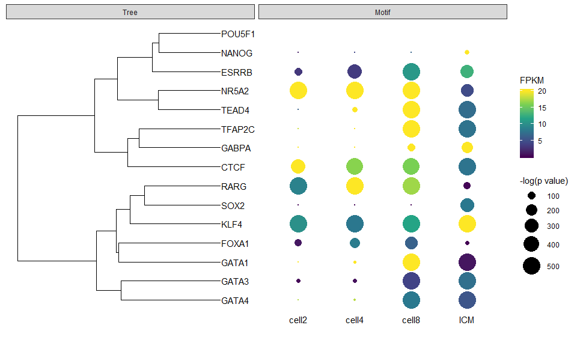

## Semantic Similarity

``` r
genes <- c("GABPA", "NANOG", "SOX2", "POU5F1", "TFAP2C", "GATA4", "GATA3",
           "GATA1", "TEAD4", "FOXA1", "RARG", "NR5A2", "ESRRB", "CTCF", "KLF4")

genes.df <- clusterProfiler::bitr(genes, "SYMBOL", "ENTREZID", "org.Hs.eg.db")
```

    ## 'select()' returned 1:1 mapping between keys and columns

``` r
eg <- genes.df[,2]
genes <- genes.df[,1]
names(genes) <- eg

library(GOSemSim)
hsGO <- godata('org.Hs.eg.db', ont="BP")
```

    ## preparing gene to GO mapping data...

    ## preparing IC data...

``` r
sim <- mgeneSim(eg, semData = hsGO, measure = "Wang", combine = "BMA", verbose=FALSE)

rownames(sim) <- genes[rownames(sim)]
colnames(sim) <- genes[colnames(sim)]
DOSE::simplot(sim)
```

    ## Using ID as id variables

<!-- -->

## Hierarchical clustering

``` r
library(ggtree)
phylo <- ape::as.phylo(hclust(as.dist(1-sim), method="ward.D"))
p = ggtree(phylo) +  geom_tiplab()
print(p + xlim(0, 0.5))
```

<!-- -->

## Semantic clustering + expression profile

``` r
library(tidyr)
library(dplyr)

mergefpkm <- read.table("easy_input.txt",header = T, as.is = 1)
head(mergefpkm)
```

    ##    gene     cell2     cell4    cell8      icm    es200     es1k     es50k
    ## 1  ATF1 2.040e-04   0.41610   0.7587  39.8500    2.781    22.15    9.9210
    ## 2  ATF2 8.545e-03   0.06188   1.2170  61.8300   18.970    20.94   16.5900
    ## 3  ATF4 1.000e-06   0.02202   0.0909   0.5796    9.861    73.39   16.0600
    ## 4 BACH1 3.506e-01  12.93000  26.6500 140.1000   82.550    83.08   49.9200
    ## 5 CLOCK 2.318e-03   0.01329   2.0520  68.3000   25.160    27.30    0.8313
    ## 6  CTCF 3.313e+02 443.00000 441.4000 970.9000 6312.000 10890.00 5981.0000
    ##                                                                      id
    ## 1              Atf1(bZIP)/K562-ATF1-ChIP-Seq(GSE31477)/Homer-GATGACGTCA
    ## 2           Atf2(bZIP)/3T3L1-Atf2-ChIP-Seq(GSE56872)/Homer-NRRTGACGTCAT
    ## 3               Atf4(bZIP)/MEF-Atf4-ChIP-Seq(GSE35681)/Homer-MTGATGCAAT
    ## 4       Bach1(bZIP)/K562-Bach1-ChIP-Seq(GSE31477)/Homer-AWWNTGCTGAGTCAT
    ## 5             CLOCK(bHLH)/Liver-Clock-ChIP-Seq(GSE39860)/Homer-GHCACGTG
    ## 6 CTCF(Zf)/CD4+-CTCF-ChIP-Seq(Barski_et_al.)/Homer-AYAGTGCCMYCTRGTGGCCA
    ##   MII_oocyte   zygote early_2cell   X2cell    X4cell    X8cell       ICM
    ## 1  43.751300 48.35030    55.12980 68.59160  77.91830  65.78570  36.12430
    ## 2  57.351200 55.16790    66.27700 53.94260  32.50640  18.20050  14.35990
    ## 3  49.306000 92.15880   118.76400 91.22960 113.91100 130.36900 128.12000
    ## 4   0.623454  1.43436     1.56799  8.56516  11.16270  16.08480   4.99782
    ## 5  11.859600 12.36550    14.31840  9.11771   2.23754   1.69165   1.03548
    ## 6  13.290000 15.96850    12.37020 38.02200  16.36380  15.91230   7.74287
    ##         mESC
    ## 1  29.247400
    ## 2   8.008880
    ## 3 116.519000
    ## 4   0.889422
    ## 5   0.918541
    ## 6  22.571800

``` r
## filtering with motifs in the nature paper:
## The landscape of accessible chromatin in mammalian preimplantation embryos
papermotif <- c("GABPA","NANOG","SOX2","POU5F1","TFAP2C","GATA4","GATA3","GATA1",
                "TEAD4","FOXA1","RARG","NR5A2","ESRRB","CTCF","KLF4")
pmergefpkm <- subset(mergefpkm, gene %in% papermotif)

pscore <- pmergefpkm[, 1:8] %>% gather(type, pscore, -gene) %>%
  group_by(gene, type) %>% summarise(pscore = max(pscore))
pscore$type[pscore$type == "icm"] = "ICM"

fpkm <- pmergefpkm[,c(1,13:17)] %>% gather(type, FPKM, -gene)
fpkm$type <- sub("^X(\\d)(.*)$", "\\2\\1", fpkm$type)

d <- left_join(pscore, fpkm, by=c("gene", "type")) %>%
  filter(!is.na(FPKM))

d$pscore[d$pscore > 500] = 500
d$pscore[d$pscore < 10] = 10
d$FPKM[d$FPKM > 20] = 20


d$type <- factor(d$type, levels = c("cell2", "cell4", "cell8", "ICM"))

library(ggplot2)

facet_plot(p, panel="Motif", data = d, 
           geom = geom_point, mapping = aes(x=as.numeric(type), size = pscore, color=FPKM)) %>%
  facet_plot(panel="Motif", data=unique(d[d$gene == "GATA4",]),
             geom = geom_text, mapping = aes(x = as.numeric(type), y=0, label=type)) + 
  xlim_expand(c(0, 0.5), "Tree") + xlim_expand(c(0.5, 4.5), "Motif") +
  scale_color_viridis_c() + theme(legend.position = "right") + 
  scale_size_continuous(range=c(0,10), name = "-log(p value)")
```

<!-- -->

## Reference

1.  Wu J, Huang B, Chen H, et al (2016) The landscape of accessible
    chromatin in mammalian preimplantation embryos. Nature 534:652-657.
    <https://doi.org/10.1038/nature18606>
2.  Yu G, Li F, Qin Y, et al (2010) GOSemSim: an R package for measuring
    semantic similarity among GO terms and gene products. Bioinformatics
    26:976-978. <https://doi.org/10.1093/bioinformatics/btq064>
3.  Yu G, Wang L-G, Han Y, He Q-Y (2012) clusterProfiler: an R Package
    for Comparing Biological Themes Among Gene Clusters. OMICS J Integr
    Biol 16:284-287. <https://doi.org/10.1089/omi.2011.0118>
4.  Yu G, Wang L-G, Yan G-R, He Q-Y (2015) DOSE: an R/Bioconductor
    package for disease ontology semantic and enrichment analysis.
    Bioinformatics 31:608-609.
    <https://doi.org/10.1093/bioinformatics/btu684>
5.  Yu G, Smith DK, Zhu H, et al (2017) ggtree: an r package for
    visualization and annotation of phylogenetic trees with their
    covariates and other associated data. Methods Ecol Evol 8:28-36.
    <https://doi.org/10.1111/2041-210X.12628>
6.  Yu G, Lam TT-Y, Zhu H, Guan Y (2018) Two Methods for Mapping and
    Visualizing Associated Data on Phylogeny Using Ggtree. Mol Biol Evol
    35:3041-3043. <https://doi.org/10.1093/molbev/msy194>
